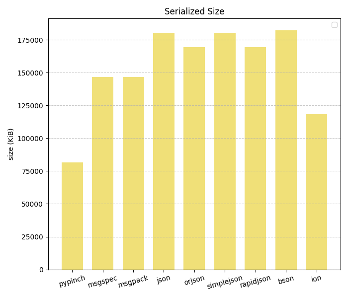
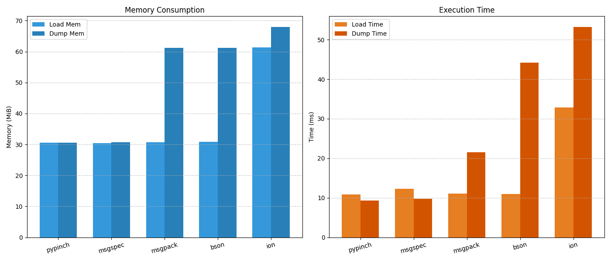
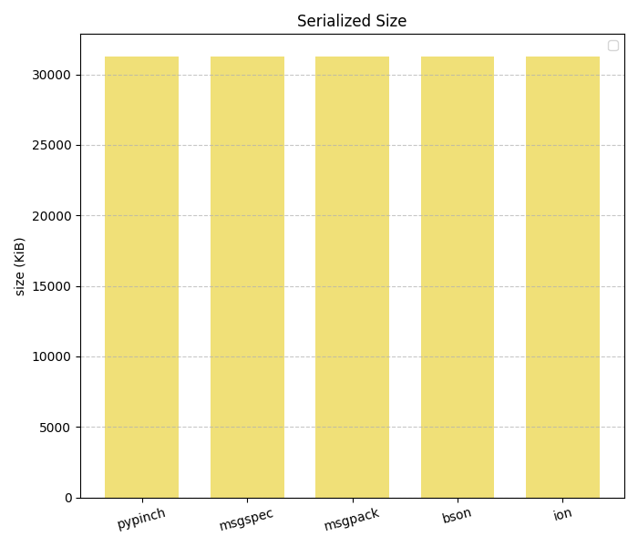
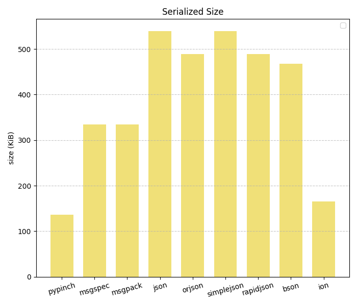
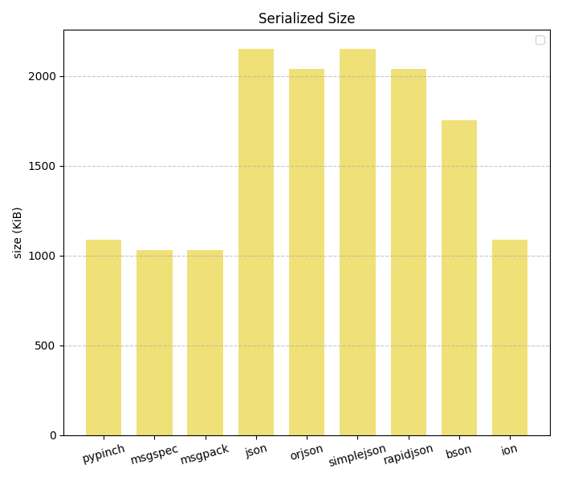

https://conda.anaconda.org/conda-forge/noarch/repodata.json

[big_binary.json](assets/benchmark_data/big_binary.json)

[twitter.json](assets/benchmark_data/twitter.json)

[citm_catalog.json](assets/benchmark_data/citm_catalog.json)

[canada.json](assets/benchmark_data/canada.json)

