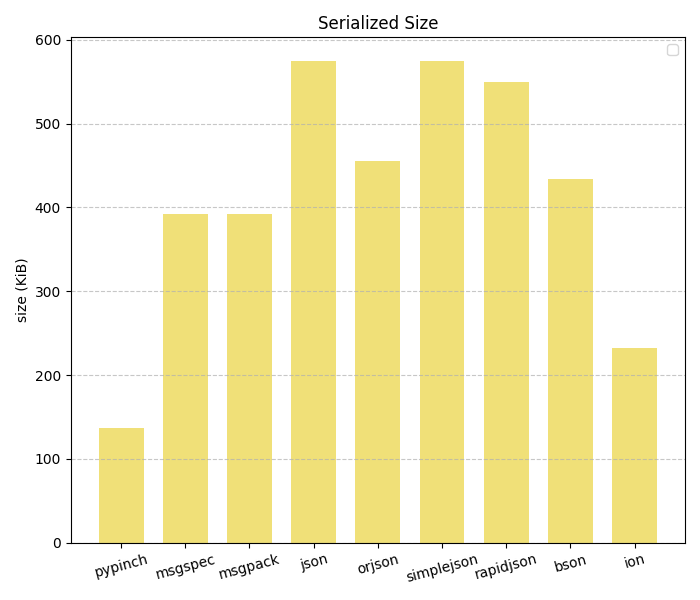

# Pinch
## Schemaless binary serialization with ZERO LIMITATIONS

[Pinch](./FORMAT_SPEC.md) is a binary serialization format, aimed to be both **fast** and **memory efficient**, while being as dynamic as possible.
* No schema needed
* Out-of-the-box support for all JSON types (+ binary!)
* Support for custom types
* No limitations:
  * ints can be indefinitely large (or small) - no limit at all
  * strings, bytes, lists, and dicts can be indefinitely long
* Extremely compact serialization, which leads to lower memory usage, easy storage, and less network traffic
* Consumes little memory while serializing\deserializing
* Supports lazy loading
* Support writing to a buffer, such as a file, to decrease memory usage
* Written in Rust ⚡️🚀🦀🔥


## Motivation
JSON is such a popular choice because of how flexible and easy it is to use. 
But it has one major flaw, is _far from efficient_. 
It also lacks support for binary data, and depending on which library you choose, also custom types.

What Pinch offers is to trade in the readability of JSON and in exchange get 
* High performance, both in speed and in memory usage
* Support for binary fields & custom types

All while still needing no schema and having 0 limitations. 

So, if reading your data by hand isn't something that's important to you, _Pinch is for you_.


## Benchmarks
Even with its great flexibility, Pinch performs on-par and often better than other, less flexible libraries:




[Full list of  Benchmarks](Benchmarks.md)


## Comparison to other options
* Protobuf / FlatBuffers / Cap'n Proto / Avro
  * You need a Schema, so if you have one go for it, but often this just isn't plausible or not worth the effort
* BSON
  * Limits the size of numbers, lists, dicts, strings, and binary
  * Limits the size of the document itself
  * Preforms rather poorly in the benchmarks
* MessagePack
  * A great option, but: 
    * Limits the size of numbers, lists, dicts, strings, and binary
    * In many cases Pinch outperforms MessagePack both in speed and in peak memory usage
* Orjson
  * High memory overhead
  * Doesn't support binary (you can, as a custom type, but it will be much less effecient)
* Pickle
  * If you're programing specifically in Python and only Python this is an option. Although it will couple you to Python which usually isn't ideal.
  * You need to be more aware of security risks
* Smile
  * Looks promising, but I couldn't find a Python3 library that worked...
* XML / YAML / TOML 
  * Why??
* Ion
  * Rather good at creating small serialized data, but not as good as Pinch
  * Terrible speed and memory consumption


## Usage

  * [Basic](#basic)
  * [Dates](#dates)
  * [Custom types](#custom-types)
  * [Lazy Loading](#lazy-loading)
  * [Writing to a file (or other buffer)](#writing-to-a-file-or-other-buffer)
  * [Optimizations](#optimizations)
  * [Exceptions](#exceptions)

### Basic
```bash
pip install pypinch
```
```python
import pypinch as pinch

original_data = {"pinchable": True, "collection": [b"101010", {}, 0.1]}
# Serialize the data
serialized_data = pinch.dump_bytes(original_data)

# And now deserialize it
loaded_data = pinch.load_bytes(serialized_data)

# Confirm they are the same
assert loaded_data == original_data
```

### Dates
Dates can be serialized to iso format.

```python
import pypinch as pinch
from datetime import datetime

now = datetime.now()

# Pass the `serialize_dates` flag
serialized = pinch.dump_bytes(now, serialize_dates=True)

# And now deserialize it
loaded_now = pinch.load_bytes(serialized)

# Confirm it worked
assert loaded_now == now.isoformat()
```
Note: If you want the deserialization to result in a datetime object you're better off using [custom types](#custom-types)  

### Custom types
For each custom type, you need to give some type of identifier. An identifier can be any default supported type.

When serializing you need to provide a function that serializes your data into a [supported type](FORMAT_SPEC.md/#basic-supported-types). 
</br>
When deserializing you need to provide a function which gets your serialized item (the output of the function you provided in the serialization phase)
and returns a deserialized object

For readability, I recommend a using a string identifier.
</br>
For performance I recommend an int.
</br>Choose whichever suites your needs best.
```python
import pypinch as pinch
from uuid import uuid4, UUID

# Types which aren't supported by default
unsupported_types = [uuid4(), 1 + 4j]

# Pass a mapping, for each type how should it be serialized
serialized = pinch.dump_bytes(unsupported_types, custom_types={
    UUID: pinch.CustomType(identifier=0, converter=lambda x: str(x)),
    complex: pinch.CustomType(identifier="complex", converter=str), # no real need for the lambda
})

# Pass a mapping, for each type (identified by its identifier) how should it be deserialized
deserialized = pinch.load_bytes(serialized, custom_types={
    0: lambda x: UUID(x),
    "complex": complex  # no real need for the lambda
})

# Confirm it worked
assert deserialized == unsupported_types
```
### Lazy Loading
Sometimes you might not want to load the whole object into memory but only a single field.
```python
import pypinch as pinch

# Setup
obj = {"people": [{"name": "Bob", "age": 30}, {"name": "Joe", "age": 45}]}
serialized_obj = pinch.dump_bytes(obj)

# Load only a specific field
field = pinch.lazy_load_bytes(serialized_obj, ["people", pinch.Idx(1), "name"])

assert field == "Joe"
```
### Writing to a file (or other buffer)
In order to save memory usage, or if this is you're desired outcome anyway, you can dump straight to a file (or anything else which has a `write(bytes)` method).

However note that because of the extra IO this will likely be significantly slower.
```python
import pypinch as pinch

# Setup
obj = b"very large data" * 10_000
with open("file", "wb") as f:
    serialized_obj = pinch.dump_bytes(obj, writer=f)
```

You can also configure how often the data should be dumped to the file:
```python
pinch.dump_bytes(
  obj, 
  writer=f, 
  flush_threshold=10*1024*1024, 
  direct_write_threshold=5*1024*1024
)
```
When the in memory buffer reaches `flush_threshold` it will flush to the `writer`.
</br>
If there is a `byte` field larger than `direct_write_threshold` it will flush directly to the `writer`.

### Optimizations
In Python, tuples are usually more memory efficient. So you can use `use_tuples=True` when deserializing to deserialize 
the lists as tuples instead.
```python
import pypinch as pinch
obj = [[1, 2], 3, [4, 5]]
serialized_obj = pinch.dump_bytes(obj)

deserialize = pinch.load_bytes(serialized_obj, use_tuples=True)

assert deserialize == ((1, 2), 3, (4, 5))
```

If you really care about speed, you can disable the GC while the deserialization is happening (use at you're own risk)
```python
pinch.load_bytes(..., stop_gc=True)
```

### Backends
When possible, Pinch uses a backend written in Rust.
But it also has a fallback implementation in Python, for cases where the Rust implementation is not available.

If you'de like to use the Python implementation, you can do so by setting this environment variable:
```bash
export PYPINCH_FORCE_PYTHON="true"
```

### Exceptions
If the data is corrupted or incorrect, Pinch will raise `pinch.DeserializationError` or `pinch.SerializationError`


By default, Pinch expects the input to `load_bytes` to be a valid input. But if you have a stream which starts with a 
valid pinch object and then more data after it, you can pass the flag `ignore_extra_data` to suppress the exception
```python
import pypinch as pinch

original_data = "data"
serialized_data = pinch.dump_bytes(original_data)

# This won't raise an exception now
loaded_data = pinch.load_bytes(serialized_data + b"extra bytes", ignore_extra_data=True)
```